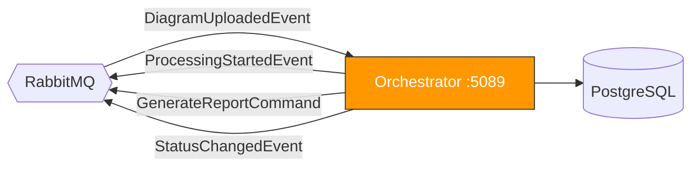
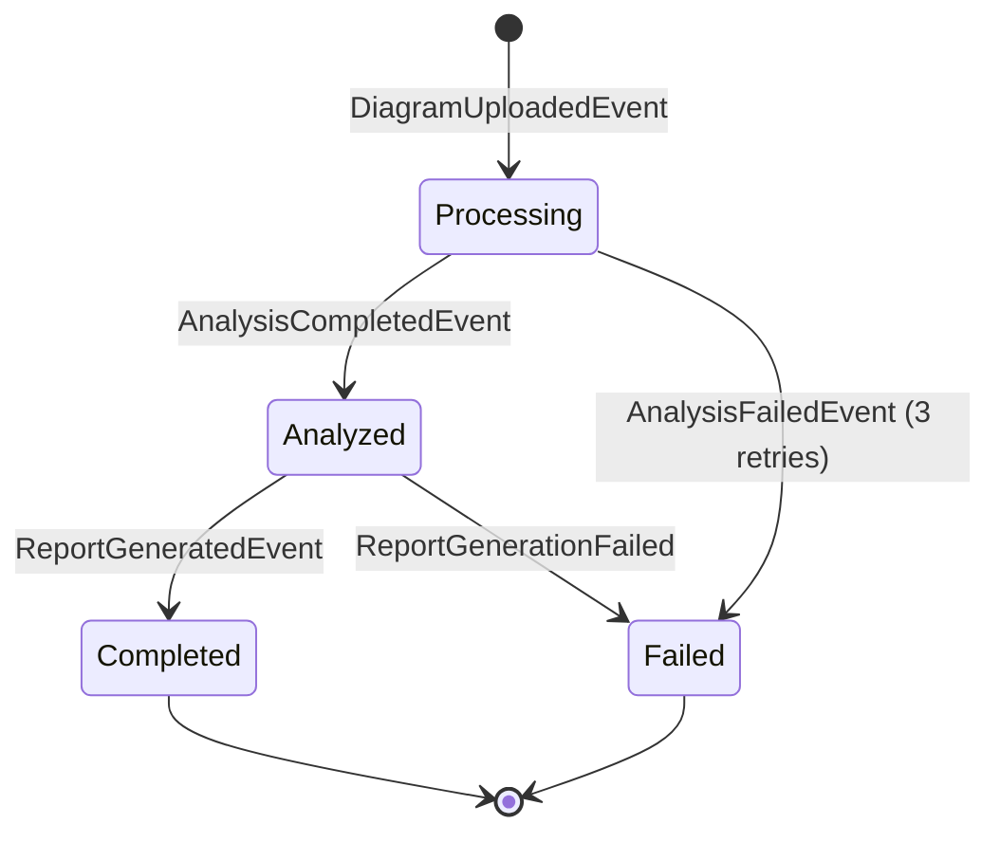

# :arrows_counterclockwise: ArchLens Orchestrator Service

SAGA state machine that orchestrates the full diagram analysis pipeline with retry logic.

## Architecture Overview



## SAGA State Machine



## Tech Stack

| Technology | Purpose |
|---|---|
| .NET 9 | Runtime |
| Clean Architecture | Project structure |
| PostgreSQL | SAGA state persistence |
| MassTransit StateMachine | SAGA orchestration |

## API Endpoints

| Method | Endpoint | Auth | Description |
|---|---|---|---|
| `GET` | `/saga/diagram/{diagramId}` | Yes | Get SAGA state by diagram ID |
| `GET` | `/saga/{correlationId}` | Yes | Get SAGA state by correlation ID |
| `GET` | `/saga/admin/metrics` | Admin | Pipeline metrics and statistics |

## Running

```bash
dotnet run --project src/ArchLens.Orchestrator.Api
```

The service starts on **port 5089**. Max **3 retries** on AI analysis failure before transitioning to Failed.

## Environment Variables

| Variable | Description | Default |
|---|---|---|
| `ConnectionStrings__DefaultConnection` | PostgreSQL connection string | — |
| `RabbitMq__Host` | RabbitMQ host | `localhost` |
